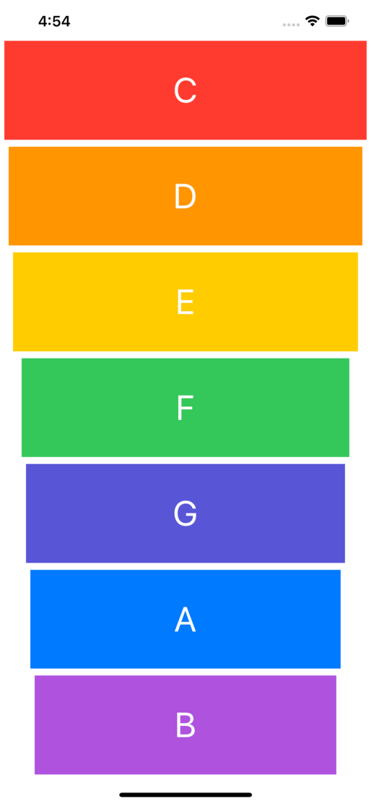

# Xylophone iOS

A simple iOS app with 7 Xylophone base sounds. This app was built for learning iOS basics development features like Storyboard, IBActions and assets in xcode. This is a training from the AppBrewery iOS masterclass from where the assets are downloaded.

### Screenshot

